# Kubernetes RBAC Security Lab

**Keyshawn Jeannot** · GitHub [@The1keyy](https://github.com/The1keyy) · MIT · Minikube

A hands-on Kubernetes security lab that shows authentication, least-privilege RBAC, workload identity, Pod Security Admission, NetworkPolicy enforcement, audit logging, automated authorization testing, and RBAC analysis.

Portfolio evidence for Kubernetes Security, Cloud Security, DevSecOps, Platform Security, and Security Engineering.

This is a learning lab, not a production Kubernetes environment.

- Case study: https://the1keyy.github.io/kubernetes-rbac-security-lab/
- Repository: https://github.com/The1keyy/kubernetes-rbac-security-lab

```bash
./scripts/setup.sh
./scripts/test-rbac.sh
```

[Architecture](#architecture) · [Access model](#access-model) · [Authentication](#authentication-vs-authorization) · [RBAC](#rbac-design) · [Validation](#rbac-validation) · [ServiceAccount](#serviceaccount-security) · [Misconfiguration](#rbac-misconfiguration-and-remediation) · [Pod Security](#pod-security-admission) · [NetworkPolicy](#network-isolation) · [Audit](#kubernetes-audit-logging) · [Scanning](#rbac-security-scanning) · [Setup](#reproducible-setup)

## What this project demonstrates

- X.509 certificate-based Kubernetes users
- Authentication versus authorization
- Namespace-scoped RBAC and namespace isolation
- ClusterRole and ClusterRoleBinding with least privilege
- Automated RBAC testing
- Kubernetes ServiceAccounts and workload identity
- Controlled RBAC misconfiguration and remediation
- Pod Security Admission
- NetworkPolicy enforcement with Calico
- Kubernetes audit logging
- RBAC permission analysis with kubectl-who-can
- Reproducible setup and cleanup scripts

## Architecture

Two namespaces: `security-lab` and `production`. The workload is a three-replica Nginx Deployment in `security-lab`.

```text
Minikube Kubernetes Cluster
│
├── security-lab
│   ├── Nginx Deployment
│   │   ├── Pod
│   │   ├── Pod
│   │   └── Pod
│   ├── developer
│   ├── auditor
│   ├── app-reader ServiceAccount
│   ├── Pod Security Admission
│   └── NetworkPolicy
│
├── production
│
└── Cluster-wide
    └── security-admin read-only pod access
```


*Three Nginx pods are Running, and the Deployment and ReplicaSet report 3/3 Ready in `security-lab`.*

More detail: [diagrams/architecture.md](diagrams/architecture.md).

## Access model

No lab identity receives unrestricted `cluster-admin`.

| Identity | Scope | Allowed | Denied |
| --- | --- | --- | --- |
| developer | `security-lab` | View, create, and delete pods; manage deployments | Production access; Secrets |
| auditor | `security-lab` | Get, list, and watch pods | Pod writes; deployments; production; Secrets |
| security-admin | Cluster-wide pod reads | Get, list, and watch pods across namespaces | Delete pods; Secrets; cluster-admin |
| app-reader | `security-lab` | Get, list, and watch pods | Pod writes; Secrets; production access |

## Authentication vs authorization

Authentication answers who you are. Authorization answers what you are allowed to do.

Human identities use X.509 client certificates. The developer authenticated successfully before any RBAC grant, and Kubernetes still denied pod access.

<table>
  <tr>
    <td width="50%" valign="top">
      
      <br><sub>Before RBAC: the developer certificate authenticates, and list pods returns Forbidden.</sub>
    </td>
    <td width="50%" valign="top">
      
      <br><sub>After the Role and RoleBinding: the same identity lists the three Running Nginx pods.</sub>
    </td>
  </tr>
</table>


*The developer certificate subject is `CN=developer` and the issuer is `minikubeCA`.*

Private keys, CSRs, kubeconfig files, and sensitive certificates stay out of this repository.

## RBAC design

### Developer

Namespace-scoped Role and RoleBinding in `security-lab`.

Allowed: get, list, and watch pods; create pods; delete pods; manage deployments.

Denied: Secrets, and the same access in `production`.


*Namespace-scoped RBAC stops developer from listing pods in `production`.*

### Auditor

Read-only pods in `security-lab`.

Allowed: get, list, and watch pods.

Denied: create pods, delete pods, manage deployments, production access, and Secrets.

### Security admin

Read-only ClusterRole for pods.

Allowed: get, list, and watch pods across namespaces.

Denied: delete pods, read Secrets, and unrestricted cluster administration.


*`security-admin` can list pods in `security-lab` and `production`, and `kubectl auth can-i delete pods` returns no.*

## RBAC validation


*Manual `can-i` checks allow developer pod and deployment actions in `security-lab`, keep auditor read-only, and deny security-admin delete and Secret access.*

### Automated RBAC testing

[`scripts/test-rbac.sh`](scripts/test-rbac.sh) runs `kubectl auth can-i` and compares identity, action, resource, namespace, expected result, and actual result. The suite covers 15 authorization checks.

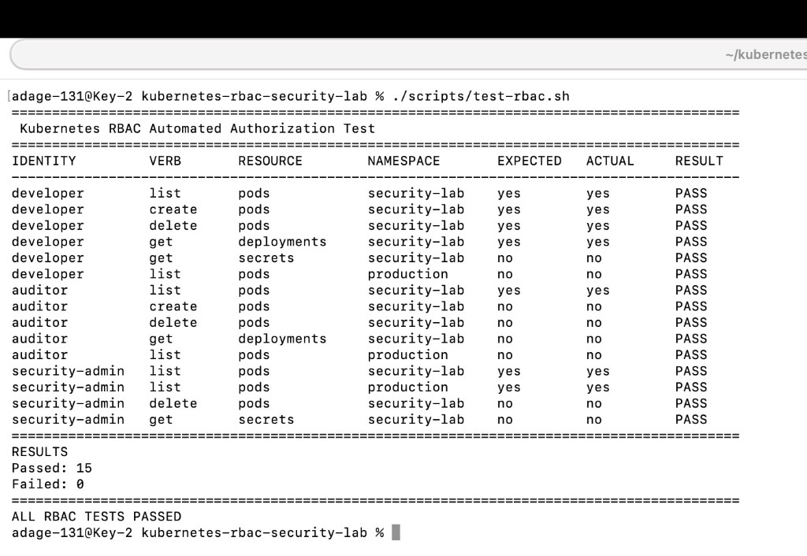

*Passed: 15. Failed: 0. That result is the local run captured in the screenshot. The same checks can be rerun after a security change.*

## ServiceAccount security

Workload identity: `system:serviceaccount:security-lab:app-reader`.

Can get, list, and watch pods. Cannot create pods, delete pods, read Secrets, or access production workloads.

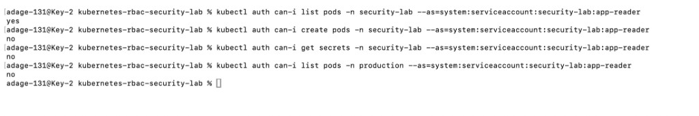

*list pods: yes · create pods: no · get secrets: no · production: no.*

See [docs/service-account-security.md](docs/service-account-security.md).

## RBAC misconfiguration and remediation

`app-reader` starts without Secret access. Applying [`misconfigurations/app-reader-secret-access.yaml`](misconfigurations/app-reader-secret-access.yaml) expands that identity to `get` and `list` Secrets. Removing the insecure Role and RoleBinding returns Secret access to denied.

The sequence shows privilege expansion, excessive permissions, detection, remediation, and validation.

<table>
  <tr>
    <td width="33%" valign="top">
      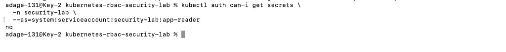
      <br><sub>Before: Secret access is denied.</sub>
    </td>
    <td width="33%" valign="top">
      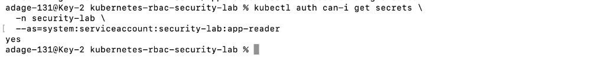
      <br><sub>After the insecure Role: Secret access is allowed.</sub>
    </td>
    <td width="33%" valign="top">
      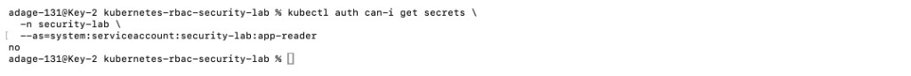
      <br><sub>After remediation: Secret access is denied again.</sub>
    </td>
  </tr>
</table>

See [docs/rbac-misconfiguration-lab.md](docs/rbac-misconfiguration-lab.md).

## Pod Security Admission

`security-lab` enforces the Kubernetes `baseline` Pod Security Standard. A pod with `securityContext.privileged: true` is rejected before it can run.

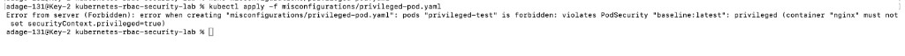

*Admission returns Forbidden: the pod violates PodSecurity `baseline:latest`.*

See [docs/pod-security-admission.md](docs/pod-security-admission.md).

## Network isolation

The Minikube cluster uses Calico, so NetworkPolicy is enforced. A test pod can reach Nginx before the policy. After `deny-nginx-ingress`, the same connection times out.

RBAC controls Kubernetes API actions. NetworkPolicy controls workload network traffic.

<table>
  <tr>
    <td width="50%" valign="top">
      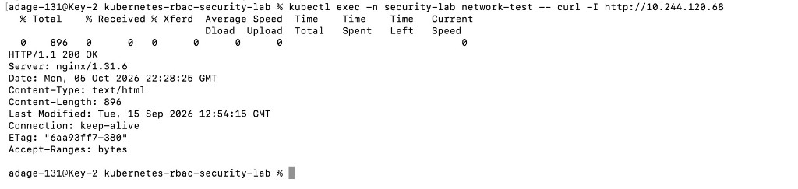
      <br><sub>Before the policy: the test pod receives HTTP/1.1 200 OK from Nginx.</sub>
    </td>
    <td width="50%" valign="top">
      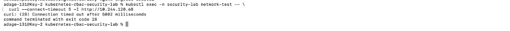
      <br><sub>After the policy: the same request times out (curl exit 28).</sub>
    </td>
  </tr>
</table>

See [docs/network-isolation.md](docs/network-isolation.md).

## Kubernetes audit logging

API audit logging is enabled at the Metadata level. Records include the requesting identity, impersonated identity, resource, namespace, action, response status, and authorization decision, without full request or response bodies.

<table>
  <tr>
    <td width="50%" valign="top">
      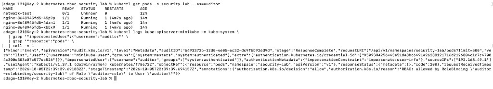
      <br><sub>Allowed: auditor lists pods. Audit shows resource pods, code 200, decision allow.</sub>
    </td>
    <td width="50%" valign="top">
      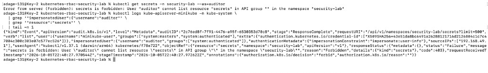
      <br><sub>Forbidden: auditor lists Secrets. Audit shows resource secrets, code 403, decision forbid.</sub>
    </td>
  </tr>
</table>

Policy: [`audit/audit-policy.yaml`](audit/audit-policy.yaml).

## RBAC security scanning

`kubectl-who-can` answers which identities can perform an action. `kubectl auth can-i` answers whether one identity can.

```bash
kubectl who-can delete pods -n security-lab
```

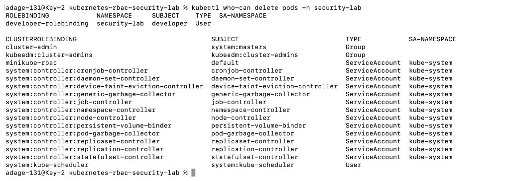

*The scanner shows the developer RoleBinding grants pod deletion in `security-lab`. Cluster system identities that can delete pods are listed as well.*

See [security-scans/rbac-findings.md](security-scans/rbac-findings.md).

## Reproducible setup

[`scripts/setup.sh`](scripts/setup.sh) checks required tools and Minikube, applies namespaces, deploys Nginx, applies human-user RBAC, creates the ServiceAccount, applies workload RBAC, enables Pod Security Admission, applies NetworkPolicy, waits for rollout, and prints a security summary.

```bash
./scripts/setup.sh
```

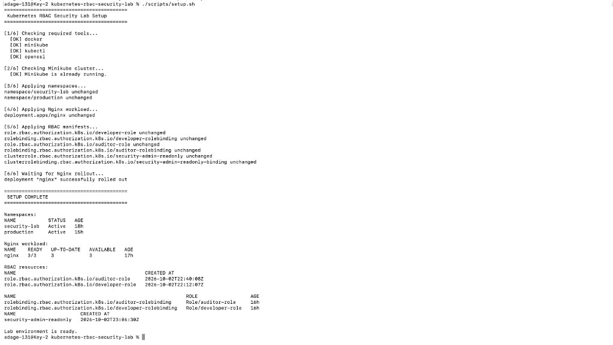

*The script finishes with `security-lab` and `production` Active, Nginx 3/3 Ready, and the lab RBAC objects present.*

### Safe cleanup

[`scripts/cleanup.sh`](scripts/cleanup.sh) removes only this lab’s resources. It does not delete Minikube, unrelated namespaces, local project files, or audit configuration files.

```bash
./scripts/cleanup.sh
```

## Static checks

[`.github/workflows/security-checks.yml`](.github/workflows/security-checks.yml) runs on push and pull request to `main`. It checks Bash syntax, runs ShellCheck on `scripts/setup.sh`, `scripts/cleanup.sh`, and `scripts/test-rbac.sh`, and lints the YAML under `manifests/`, `misconfigurations/`, `audit/`, and `.github/workflows/`.

The workflow file is not evidence that the latest run passed. The 15 passed / 0 failed figure comes from the local `scripts/test-rbac.sh` capture above.

## Repository structure

```text
kubernetes-rbac-security-lab/
├── README.md
├── index.html
├── style.css
├── LICENSE
├── images/
│   └── keyshawn-jeannot.png
├── .github/
│   └── workflows/
│       └── security-checks.yml
├── manifests/
│   ├── namespaces.yaml
│   ├── nginx-deployment.yaml
│   ├── developer-role.yaml
│   ├── developer-rolebinding.yaml
│   ├── auditor-role.yaml
│   ├── auditor-rolebinding.yaml
│   ├── security-admin-clusterrole.yaml
│   ├── security-admin-clusterrolebinding.yaml
│   ├── app-reader-serviceaccount.yaml
│   ├── app-reader-role.yaml
│   ├── app-reader-rolebinding.yaml
│   └── network-policies/
│       └── deny-nginx-ingress.yaml
├── misconfigurations/
│   ├── app-reader-secret-access.yaml
│   └── privileged-pod.yaml
├── scripts/
│   ├── setup.sh
│   ├── cleanup.sh
│   └── test-rbac.sh
├── audit/
│   └── audit-policy.yaml
├── security-scans/
│   └── rbac-findings.md
├── docs/
│   ├── security-findings.md
│   ├── threat-model.md
│   ├── service-account-security.md
│   ├── rbac-misconfiguration-lab.md
│   ├── pod-security-admission.md
│   └── network-isolation.md
├── diagrams/
│   └── architecture.md
└── screenshots/
```

## Security controls demonstrated

| Control | Security purpose |
| --- | --- |
| X.509 authentication | Establish user identity |
| RBAC | Restrict Kubernetes API permissions |
| Namespace isolation | Reduce access scope and blast radius |
| Least privilege | Limit permissions to required actions |
| ServiceAccounts | Provide workload identity |
| Pod Security Admission | Block unsafe pod configurations |
| NetworkPolicy | Restrict pod-to-pod network communication |
| Audit logging | Record API and authorization activity |
| Automated RBAC tests | Detect unexpected authorization changes |
| RBAC scanning | Identify identities with sensitive privileges |

## Threats addressed

- Overprivileged users and ServiceAccounts
- Compromised credentials
- Cross-namespace lateral movement
- Excessive ClusterRole permissions
- Accidental Secret exposure
- Privileged workloads
- Unrestricted pod-to-pod traffic
- Incorrect RoleBindings
- Privilege expansion through RBAC changes

See [docs/threat-model.md](docs/threat-model.md).

## Security practices

Sensitive files stay uncommitted. `.gitignore` excludes `*.key`, `*.csr`, `certificates/`, `kubeconfig`, `*.kubeconfig`, `ca.key`, and `sa.key`.

Do not commit private keys, cluster CA private keys, Kubernetes Secrets, bearer tokens, kubeconfig credentials, passwords, or cloud credentials.

## Tools

Kubernetes, Minikube, Docker Desktop, Calico, kubectl, kubectl-who-can, Krew, OpenSSL, Bash, YAML, Git, GitHub, GitHub Actions, and macOS Terminal.

## Key security lessons

- Authentication does not automatically provide authorization.
- Namespace-scoped RBAC can reduce blast radius.
- Cluster-wide permissions should be narrowly defined.
- ServiceAccounts should follow least privilege.
- Small RBAC changes can create meaningful privilege expansion.
- Pod Security Admission can prevent unsafe workloads before execution.
- NetworkPolicy provides isolation that RBAC alone cannot provide.
- Audit logs provide evidence for successful and denied activity.
- Automated validation makes security controls easier to maintain.
- Security scanning can expose unexpected or excessive permissions.

## License

MIT. This repository is for learning, security experimentation, and portfolio demonstration.

The case study page is `index.html` and `style.css` at the repository root. GitHub Pages publishes that root from `main` at https://the1keyy.github.io/kubernetes-rbac-security-lab/.

Do not commit sensitive Kubernetes credentials or private keys.
