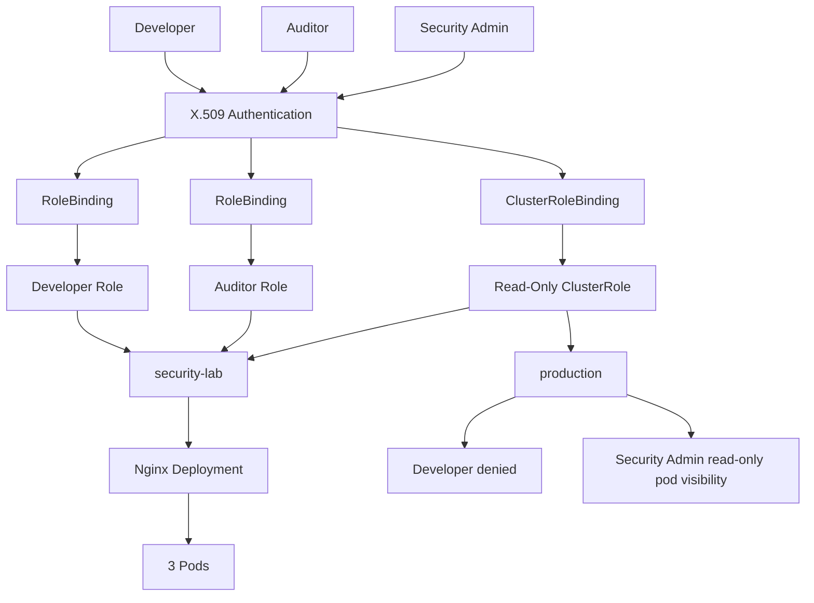
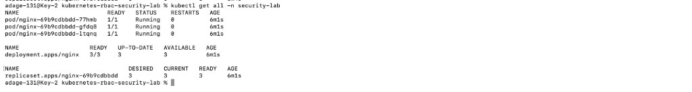
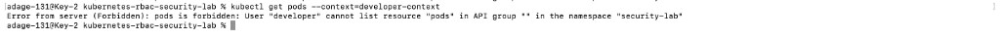
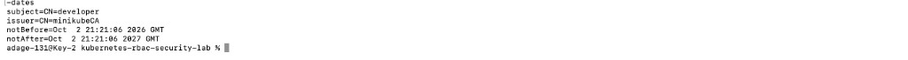
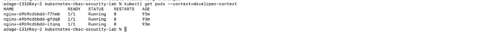
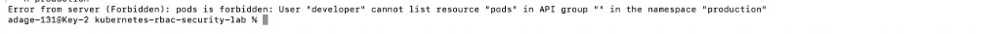
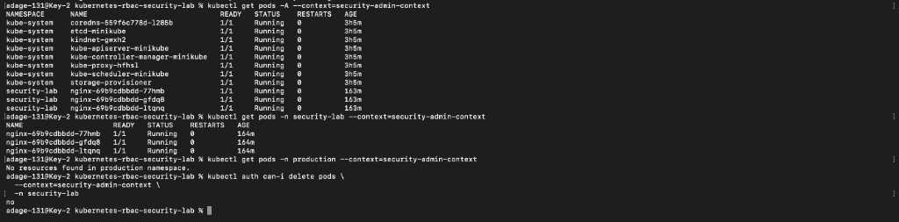
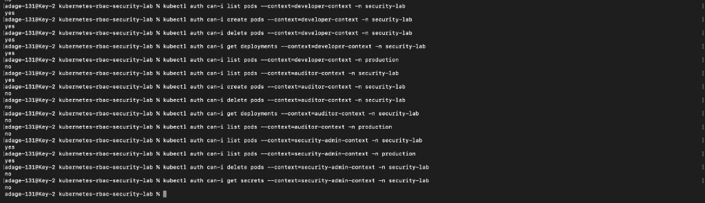

# Kubernetes RBAC Security Lab

This local Minikube lab shows how Kubernetes authenticates users with X.509 certificates and then authorizes them with RBAC. Three identities — `developer`, `auditor`, and `security-admin` — receive least-privilege access, while positive and negative tests confirm both allowed and denied actions.

## Why this project matters

Cluster-admin access is convenient and dangerous. If every operator, pipeline, or compromised laptop inherits broad permissions, a single credential leak can create, modify, or delete workloads across namespaces.

This lab treats that as a security problem, not a YAML exercise. It separates authentication from authorization, scopes developer access to one namespace, gives an auditor read-only pod visibility, and grants a cluster-scoped identity only the pod-read permissions it needs — not `cluster-admin`.

## Security objectives

- Authenticate users with X.509 client certificates (`CN=developer`, `CN=auditor`, `CN=security-admin`).
- Authorize those users with Kubernetes RBAC, not implicit admin rights.
- Apply least privilege: each identity receives only the verbs and resources required for its role.
- Isolate namespaces so `security-lab` permissions do not apply to `production`.
- Contrast namespace-scoped `Role` / `RoleBinding` with cluster-scoped `ClusterRole` / `ClusterRoleBinding`.
- Keep Kubernetes Secrets out of these identities’ permission sets.
- Validate access with `kubectl auth can-i` for both allow and deny cases.

## Architecture

Two namespaces exist in the local cluster. The Nginx test workload runs in `security-lab`. `production` is used only to prove that developer permissions do not cross namespaces.



A longer description lives in [diagrams/architecture.md](diagrams/architecture.md).

## Environment

This is a **local Minikube lab**. It is not a production Kubernetes cluster, managed cloud service, or production PKI.

| Item | Value |
| --- | --- |
| Host | macOS |
| Architecture | Apple Silicon |
| Container runtime | Docker Desktop |
| Kubernetes | Minikube |
| CLI | kubectl |
| Authentication | X.509 client certificates |
| Authorization | Kubernetes RBAC |

No cloud accounts or paid infrastructure are required.

## Technologies used

Kubernetes, Minikube, Docker Desktop, kubectl, OpenSSL, YAML, Git, GitHub.

## Test workload

A namespace named `security-lab` hosts an Nginx Deployment with three replicas. That Deployment is the protected resource used for RBAC tests.

```text
security-lab
└── nginx Deployment
    └── ReplicaSet
        ├── nginx Pod
        ├── nginx Pod
        └── nginx Pod
```

A second namespace, `production`, exists so namespace isolation can be tested. Developer access is not granted there.



## Authentication vs authorization

**Authentication** answers *who are you?* Each lab user presents an X.509 client certificate. The certificate subject identifies the Kubernetes user, for example `CN=developer`.

**Authorization** answers *what are you allowed to do?* Kubernetes RBAC decides whether that authenticated user may get, list, create, or delete a resource.

Before any Role or RoleBinding existed, the authenticated `developer` user could not list pods:

```text
Error from server (Forbidden): pods is forbidden: User "developer" cannot list resource "pods" in API group "" in the namespace "security-lab"
```



A valid certificate therefore proves identity. It does not grant access.

## X.509 identity creation overview

Three users were created: `developer`, `auditor`, and `security-admin`.

For each identity, a private key and Certificate Signing Request (CSR) were generated, the CSR was signed by the local Minikube certificate authority, and the resulting certificate and key were added to a local kubeconfig context.

Authentication was confirmed **before** RBAC was applied, so the Forbidden responses below are authorization failures, not login failures.

The developer client certificate used in this lab has subject `CN=developer` and issuer `CN=minikubeCA`.



Private keys, CSRs, kubeconfig files, and CA material are not in this repository. See [Security precautions](#security-precautions).

## Developer RBAC

The developer uses a namespace-scoped `Role` and `RoleBinding` in `security-lab`.

| Resource | API group | Verbs |
| --- | --- | --- |
| pods | `""` (core) | `get`, `list`, `watch`, `create`, `delete` |
| deployments | `apps` | `get`, `list`, `watch`, `create`, `update`, `patch`, `delete` |

Manifests:

- [manifests/developer-role.yaml](manifests/developer-role.yaml)
- [manifests/developer-rolebinding.yaml](manifests/developer-rolebinding.yaml)

The RoleBinding subject is the User `developer`. Permissions apply only in `security-lab`. Secrets are not included. The identity is not `cluster-admin`.

After the Role and RoleBinding were applied, the same user listed the three Nginx pods:



## Auditor RBAC

The auditor is a read-only identity in `security-lab`.

| Resource | API group | Verbs |
| --- | --- | --- |
| pods | `""` (core) | `get`, `list`, `watch` |

The auditor cannot create or delete pods and has no deployment verbs. Dedicated `kubectl get pods` / create-delete screenshots for the auditor are not in this repository. The captured `kubectl auth can-i` matrix shows auditor `list pods` = `yes` and `create` / `delete` / `get deployments` = `no` in `security-lab`.

Manifests:

- [manifests/auditor-role.yaml](manifests/auditor-role.yaml)
- [manifests/auditor-rolebinding.yaml](manifests/auditor-rolebinding.yaml)

## Namespace isolation

`developer` is authorized in `security-lab` only. Equivalent pod listing in `production` is denied:

```text
Error from server (Forbidden): pods is forbidden: User "developer" cannot list resource "pods" in API group "" in the namespace "production"
```



Namespace-scoped Roles limit blast radius: stolen developer credentials do not automatically become production credentials.

## Role vs ClusterRole

A **Role** grants permissions inside one namespace. `developer-role` and `auditor-role` exist only in `security-lab`.

A **RoleBinding** attaches a user to that Role. Without the binding, the Role does nothing for that user.

A **ClusterRole** defines permissions that can apply cluster-wide. A **ClusterRoleBinding** attaches a user to that ClusterRole across namespaces.

This lab uses cluster-scoped objects only for the security-admin identity, and only for read-only pod access.

## ClusterRole and ClusterRoleBinding example

`security-admin` is bound to ClusterRole `security-admin-readonly`:

| Resource | API group | Verbs |
| --- | --- | --- |
| pods | `""` (core) | `get`, `list`, `watch` |

Manifests:

- [manifests/security-admin-clusterrole.yaml](manifests/security-admin-clusterrole.yaml)
- [manifests/security-admin-clusterrolebinding.yaml](manifests/security-admin-clusterrolebinding.yaml)

That identity can list pods in both `security-lab` and `production`. It cannot delete pods, cannot read Secrets, and is not granted `cluster-admin`.

`kubectl get pods -A --context=security-admin-context` returned pods from `kube-system` and `security-lab`. `kubectl get pods -n production` with the same context returned `No resources found in production namespace` rather than Forbidden, which is an authorized empty list. `kubectl auth can-i delete pods` in `security-lab` returned `no`.




`07` and `08` are the same terminal session: cross-namespace reads and the delete denial appear together.

Cluster-scoped bindings increase blast radius even when they are read-only. They should stay narrow and rare.

## Access-control matrix

Permissions below are what the manifests grant. “View Pods” for developer and auditor is namespace-scoped to `security-lab`. Security-admin pod reads are cluster-scoped.

| Identity | View Pods | Create Pods | Delete Pods | Deployment Access | Production Access | Secrets |
| --- | --- | --- | --- | --- | --- | --- |
| Developer | Yes | Yes | Yes | Yes | No | No |
| Auditor | Yes | No | No | No | No | No |
| Security Admin | Yes | No | No | No | Read-only pods | No |

## Security validation

RBAC was checked with `kubectl auth can-i` after the identities and bindings were in place. The results below were captured in the lab (see the screenshot). They match the YAML rules.

**Developer** (`developer-context`)

| Check | Result |
| --- | --- |
| `list pods` in `security-lab` | `yes` |
| `create pods` in `security-lab` | `yes` |
| `delete pods` in `security-lab` | `yes` |
| `get deployments` in `security-lab` | `yes` |
| `list pods` in `production` | `no` |

**Auditor** (`auditor-context`)

| Check | Result |
| --- | --- |
| `list pods` in `security-lab` | `yes` |
| `create pods` in `security-lab` | `no` |
| `delete pods` in `security-lab` | `no` |
| `get deployments` in `security-lab` | `no` |
| `list pods` in `production` | `no` |

**Security admin** (`security-admin-context`)

| Check | Result |
| --- | --- |
| `list pods` in `security-lab` | `yes` |
| `list pods` in `production` | `yes` |
| `delete pods` in `security-lab` | `no` |
| `get secrets` in `security-lab` | `no` |



Developer Secret access was not included in that capture. The developer Role does not list `secrets`, so Secret get/list is not granted by these manifests.

Denied actions are as important as allowed ones. A Role that only appears to work because `kubectl apply` succeeded is not validated.

## Screenshots / evidence

Terminal captures from the Minikube lab. Index and naming notes: [screenshots/README.md](screenshots/README.md).

| File | Concept | What it proves |
| --- | --- | --- |
| `00-nginx-workload-security-lab.png` | Test workload | Nginx Deployment, 3/3 pods in `security-lab` |
| `01-certificate-identity.png` | Authentication | X.509 subject `CN=developer`, issuer `CN=minikubeCA` |
| `02-developer-forbidden-before-rbac.png` | AuthN vs AuthZ | Authenticated developer cannot list pods until RBAC exists |
| `03-developer-access-after-rbac.png` | RBAC | Developer lists the three Nginx pods after RoleBinding |
| `06-developer-denied-production.png` | Namespace isolation | Developer is Forbidden in `production` |
| `07-security-admin-cross-namespace-access.png` | ClusterRole | Security-admin can `get pods -A` |
| `08-security-admin-delete-denied.png` | Least privilege | Same session: `auth can-i delete pods` returns `no` |
| `09-rbac-can-i-matrix.png` | Validation | Grouped allow/deny results for all three identities |

Not captured as separate files: `04-auditor-readonly-access.png` (auditor `kubectl get pods`) and `05-auditor-denied-create-delete.png`. Auditor allow/deny is in `09-rbac-can-i-matrix.png`.

## Security findings

The lab findings are documented in [docs/security-findings.md](docs/security-findings.md). In short:

1. Authentication is not authorization.
2. Developer permissions stay inside `security-lab`.
3. The auditor is read-only on pods.
4. Secrets are not granted to these identities.
5. Cluster-scoped access increases blast radius even when it is read-only.
6. RoleBindings decide who receives a Role.
7. ClusterRoleBindings need extra review.
8. Authorization should be tested, not assumed.

## Threat model

See [docs/threat-model.md](docs/threat-model.md). The lab considers:

- Overprivileged users
- Compromised Kubernetes credentials
- Excessive ClusterRole permissions
- Cross-namespace lateral movement
- RoleBinding misconfiguration
- ClusterRoleBinding misconfiguration

Each threat is paired with a control used in this lab and a validation method such as `kubectl auth can-i` or a Forbidden API response.

## Repository structure

```text
kubernetes-rbac-security-lab/
├── README.md
├── .gitignore
├── manifests/
│   ├── developer-role.yaml
│   ├── developer-rolebinding.yaml
│   ├── auditor-role.yaml
│   ├── auditor-rolebinding.yaml
│   ├── security-admin-clusterrole.yaml
│   └── security-admin-clusterrolebinding.yaml
├── screenshots/
│   ├── README.md
│   ├── 00-nginx-workload-security-lab.png
│   ├── 01-certificate-identity.png
│   ├── 02-developer-forbidden-before-rbac.png
│   ├── 03-developer-access-after-rbac.png
│   ├── 06-developer-denied-production.png
│   ├── 07-security-admin-cross-namespace-access.png
│   ├── 08-security-admin-delete-denied.png
│   └── 09-rbac-can-i-matrix.png
├── diagrams/
│   └── architecture.md
├── docs/
│   ├── threat-model.md
│   └── security-findings.md
└── scripts/
    └── README.md
```

## Security precautions

Private keys, CSRs, kubeconfig credentials, Minikube CA private keys, and other authentication material are excluded from Git.

Do not commit:

- `*.key`
- `*.csr`
- `kubeconfig` / `*.kubeconfig`
- `ca.key` / `sa.key`
- `certificates/`

`.gitignore` already covers those patterns. Local certificate files used for this lab live under `certificates/` on the workstation and are ignored.

This lab signed client certificates with the local Minikube CA because that is how a Minikube cluster authenticates users. That is not a production certificate-management design. Production clusters should use a controlled PKI or an identity provider, and CA private keys should not be available to application developers.

## Reproduction overview

Reproduce the **authorization** portion locally with Docker Desktop, Minikube, and kubectl:

```bash
minikube start
kubectl get nodes
kubectl apply -f manifests/
```

Namespaces (`security-lab`, `production`), the Nginx Deployment, X.509 users, and kubeconfig contexts must be created on the local machine. Those credentials are not published here.

After identities exist, apply the manifests and re-run the `kubectl auth can-i` checks in [Security validation](#security-validation).

## Lessons learned

- A certificate identifies a user; RBAC decides what that user can do.
- Least privilege is a set of verbs and resources, not a role name.
- Namespace-scoped Roles contain blast radius.
- RoleBindings and ClusterRoleBindings are the actual grant.
- Cluster-scoped read access is still cluster-scoped access.
- Test denies as well as allows.
- Credentials do not belong in Git.

## Future improvements

Natural extensions of this lab, not implemented here:

- ServiceAccount RBAC and workload identity
- NetworkPolicies
- Pod Security Standards / Pod Security Admission
- Secrets encryption and access review
- Admission policies (Kyverno or OPA Gatekeeper)
- Kubernetes audit logging
- Image scanning
- Automated RBAC tests in CI

---

This project is an educational Minikube lab. It does not represent production Kubernetes operations, production PKI, or a live multi-tenant platform.
