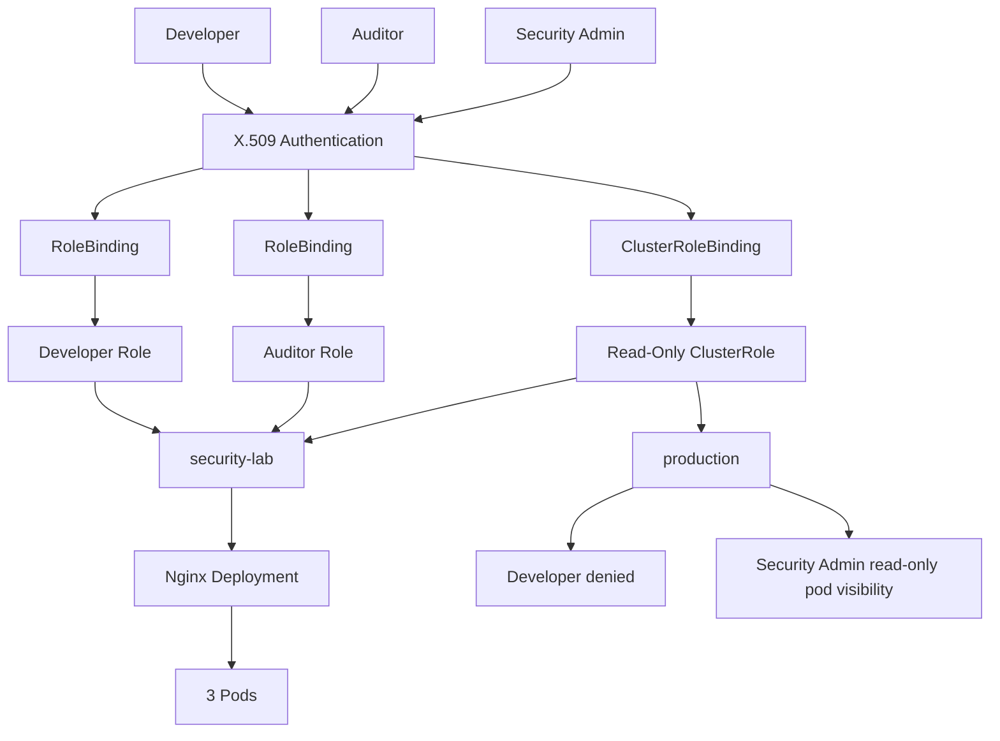

# Architecture

Minikube. Two namespaces. Three cert users. Nginx with 3 pods in `security-lab`.

| User | Binding | Role | Reach |
| --- | --- | --- | --- |
| Developer | RoleBinding | Developer Role | `security-lab`: pods get/list/watch/create/delete, deployments get/list/watch/create/update/patch/delete |
| Auditor | RoleBinding | Auditor Role | `security-lab`: pods get/list/watch |
| Security Admin | ClusterRoleBinding | Read-only ClusterRole | Pods get/list/watch in all namespaces |

`production` has no developer or auditor Role. Security-admin can still list pods there because of the ClusterRoleBinding. No Secrets. No `cluster-admin`.
