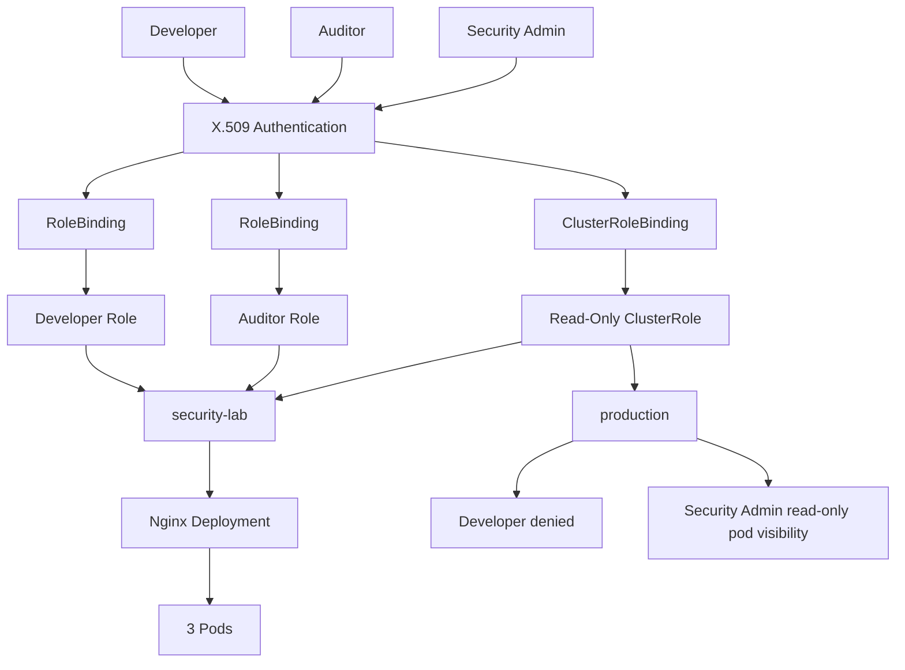

# Architecture

Local Minikube cluster with two namespaces, three X.509 users, and a three-replica Nginx Deployment in `security-lab`.

## Identity paths

| Identity | Authentication | Binding | Permission object | Reach |
| --- | --- | --- | --- | --- |
| Developer | X.509 | RoleBinding | Developer Role | `security-lab` only: pods (get/list/watch/create/delete) and deployments (get/list/watch/create/update/patch/delete) |
| Auditor | X.509 | RoleBinding | Auditor Role | `security-lab` only: pods get/list/watch |
| Security Admin | X.509 | ClusterRoleBinding | Read-only ClusterRole | Pods get/list/watch across namespaces, including `production` |

## Namespaces

| Namespace | Workload | Developer | Auditor | Security Admin |
| --- | --- | --- | --- | --- |
| `security-lab` | Nginx Deployment, 3 pods | Allowed per Role | Read-only pods | Read-only pods |
| `production` | Isolation target (no developer Role) | Denied | Denied (no Role there) | Read-only pods via ClusterRoleBinding |

The auditor Role exists only in `security-lab`, so auditor access does not extend to `production`. Security-admin visibility in `production` comes from the cluster-scoped binding, not from a production Role.

None of these identities receive Secret permissions or `cluster-admin`.
